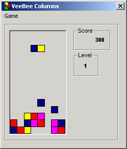



## A Game of COLUMNS Using A Picturebox and Intrinsic Functions

### Description

Started working on this about 6 months ago, and laid dormant on my computer till the last

few days where I actually got to solve some major/minor bugs and actually got it to a playable

state. 

This is the first simple game that I've worked on.  

Decided to use intrisic functions to keep it simple. Coding this created more logical and code issues rather than

technical issues such as using bitblt/directx  

Anyway, I'm still tinkering with the code at the moment and adding some more gameplay functions to make it more fun.  Stay tuned!
 
### More Info
 

             |
---                |---
**Submitted On**   |2001-02-01 10:19:50
**By**             |[Perry Loh](https://github.com/Planet-Source-Code/PSCIndex/blob/master/ByAuthor/perry-loh.md)
**Level**          |Intermediate
**User Rating**    |4.6 (23 globes from 5 users)
**Compatibility**  |VB 5\.0, VB 6\.0
**Category**       |[Games](https://github.com/Planet-Source-Code/PSCIndex/blob/master/ByCategory/games__1-38.md)
**World**          |[Visual Basic](https://github.com/Planet-Source-Code/PSCIndex/blob/master/ByWorld/visual-basic.md)
**Archive File**   |[CODE\_UPLOAD143871312001\.zip](https://github.com/Planet-Source-Code/perry-loh-a-game-of-columns-using-a-picturebox-and-intrinsic-functions__1-14892/archive/master.zip)

